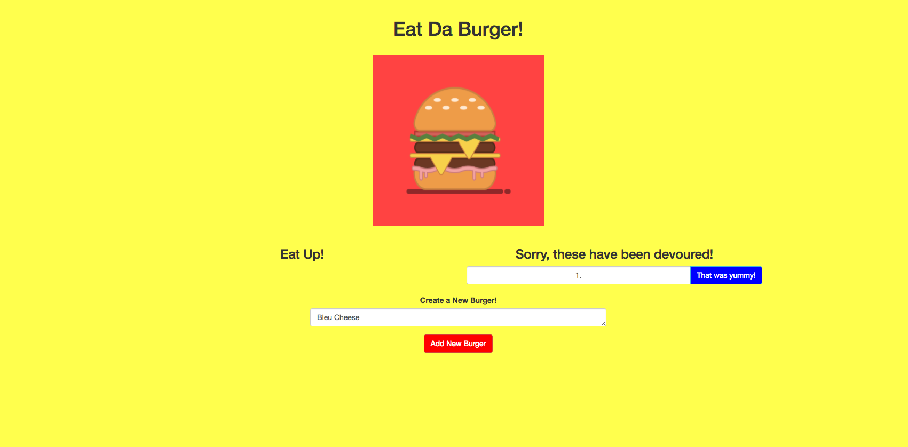
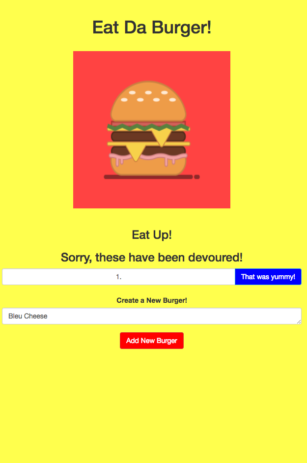

sequelizedBurger

An application that allows users to create, log and devour custom made burgers using MySQL and Sequelize. 

The final application has been deployed through Heroku and can be accessed with the following link: https://aqueous-bastion-39124.herokuapp.com/

Below is a screenshot of the application's UI on a desktop:

Below is a screenshot of the application's UI on a mobile device:

